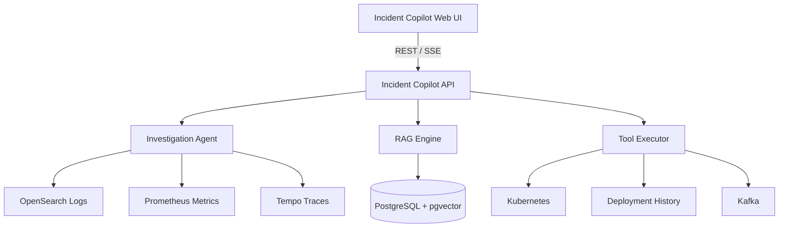
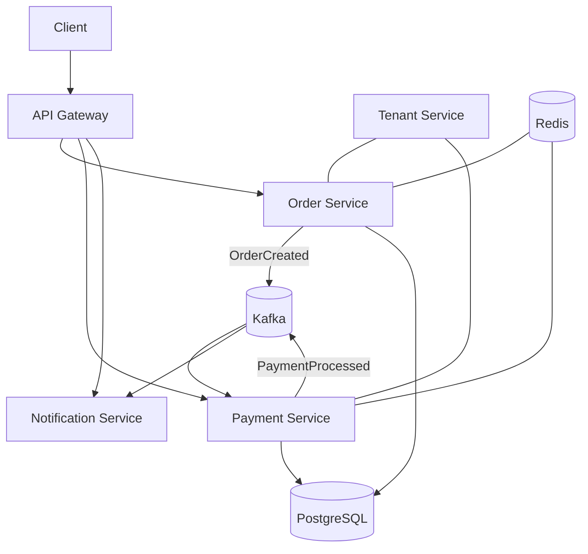

# AI Incident Copilot

AI Incident Copilot is a portfolio-grade incident investigation platform for a realistic, multi-tenant microservice system. It combines Java 21, Spring Boot, Kafka, PostgreSQL, observability, retrieval-augmented generation, and tool-driven AI reasoning in one end-to-end demonstration.

The project is intentionally built in phases. Each phase must produce working, testable software and strengthen one polished demo instead of adding disconnected technologies.

> **Current status:** Phase 1 foundation implemented; unit verification is available with `mvn test`.

## The demo we are building toward

The primary success criterion is a repeatable 2–3 minute incident workflow:

1. The platform starts healthy.
2. `payment-service` version `2.4.1` is deployed.
3. A controlled database connection-pool defect is triggered for `tenant-217`.
4. Metrics and logs show elevated payment failures.
5. An operator asks: **“Why are payments failing for tenant-217?”**
6. The Copilot queries metrics, logs, traces, Kafka lag, deployment history, runbooks, and similar incidents.
7. It identifies database pool exhaustion, correlates it with the deployment, and presents evidence with a confidence score.
8. A human approves the recommended rollback.
9. The service recovers and the Copilot generates an evidence-backed RCA.

The model must never invent incident facts or directly execute privileged remediation commands.

## Target architecture



The Copilot investigates a deliberately realistic application:



Phase 1 starts with four services:

```text
services/
├── order-service
├── payment-service
├── notification-service
└── tenant-service
```

## Core engineering principles

- **Tenant-aware by default:** every synchronous request and asynchronous event carries a tenant ID and correlation ID.
- **Evidence before conclusions:** the Copilot gathers and correlates evidence before proposing a root cause.
- **Tools over unrestricted agents:** external systems are accessed through typed, auditable investigation tools.
- **Human-approved remediation:** the model recommends; policy and people authorize; deterministic executors act.
- **Reproducible incidents:** failure scenarios are controlled and measurable rather than represented by static fake logs.
- **Evaluation over anecdotes:** claims about accuracy, latency, and cost come from executed scenarios.
- **Vertical slices over platform sprawl:** each phase leaves the repository runnable and demonstrable.

## Multi-tenancy contract

Every inbound request must include:

```http
X-Tenant-ID: tenant-217
X-Correlation-ID: 86f7b51e-0de3-4a2e-bfa6-3ec8d69d1138
```

The platform propagates both values through HTTP, Kafka headers, structured logs, metrics, and traces. Missing or malformed identifiers are rejected at the boundary rather than silently replaced.

The Phase 1 domain representation is:

```java
public record TenantContext(String tenantId, String correlationId) {}
```

Tenant isolation is part of repository and query design: reads and writes must always be scoped by `tenantId`.

## Phase 1 scope: tenant-aware order workflow

The first milestone implements one end-to-end path:

```text
POST /orders
    → order-service persists the order
    → OrderCreated is published to Kafka
    → payment-service records the payment
    → PaymentProcessed is published to Kafka
    → notification-service records delivery
```

### Phase 1 technology

- Java 21
- Spring Boot 3.x
- Maven multi-module build
- Spring Data JPA
- PostgreSQL
- Redis
- Apache Kafka
- Docker Compose
- JUnit 5, Testcontainers, and Awaitility

### Phase 1 acceptance criteria

- One command starts PostgreSQL, Kafka, Redis, and the four services locally.
- `POST /orders` returns `202 Accepted` with an order ID and correlation ID.
- The order, payment, and notification records reach their expected terminal states asynchronously.
- Tenant and correlation identifiers survive every HTTP and Kafka boundary.
- Duplicate event delivery does not create duplicate payments or notifications.
- Cross-tenant reads cannot return another tenant’s records.
- Invalid tenants and missing context headers receive documented 4xx responses.
- Unit and integration tests run without depending on manually installed infrastructure.

### Phase 1 implementation plan

Phase 1 is delivered as small, independently verifiable slices:

1. **Build foundation — complete**
   - Create the Java 21 Maven reactor.
   - Add immutable tenant and event contracts.
   - Test valid and malformed tenant context.
2. **Tenant boundary — complete**
   - Add the tenant service and active-tenant lookup.
   - Return `404 Not Found` for unknown tenants.
   - Test known and unknown tenant requests.
3. **Order workflow — complete**
   - Validate tenant and correlation headers.
   - Persist tenant-scoped orders.
   - Publish `OrderCreated` events and return `202 Accepted`.
   - Test persistence, event publication, and invalid tenants.
4. **Payment processing — complete**
   - Consume `OrderCreated` events.
   - Persist payments and publish `PaymentProcessed` events.
   - Enforce idempotency through consumer checks and database uniqueness.
   - Test context propagation and duplicate delivery.
5. **Notification processing — complete**
   - Consume `PaymentProcessed` events.
   - Persist delivered notifications with tenant and correlation context.
   - Enforce and test idempotent delivery.
6. **Local runtime — complete**
   - Package every service as an executable Spring Boot JAR.
   - Add PostgreSQL, Redis, Kafka, and all four services to Docker Compose.
   - Validate the Compose configuration.
7. **Final verification — complete**
   - Run the complete Maven test and package lifecycle.
   - Check repository diffs and document local usage.

Phase 1 is complete when `mvn test` passes without manually running infrastructure,
`docker compose up --build` starts the complete stack, tenant context survives the
workflow, cross-tenant repository access is scoped, and duplicate events cannot
create duplicate payment or notification records.

The standalone [Phase 1 plan](docs/superpowers/plans/2026-10-05-phase-1-microservice-foundation.md)
is retained as supporting documentation; the README is the primary status source.

### Run Phase 1

Start the complete local stack:

```bash
docker compose up --build
```

Create an order after the services are ready:

```bash
curl -i -X POST http://localhost:8082/orders \
  -H 'Content-Type: application/json' \
  -H 'X-Tenant-ID: tenant-217' \
  -H 'X-Correlation-ID: 86f7b51e-0de3-4a2e-bfa6-3ec8d69d1138' \
  -d '{"amount": 12.50}'
```

Run the infrastructure-independent test suite with `mvn test`.

## Delivery roadmap

| Week | Outcome | Demo checkpoint |
|---|---|---|
| 1 | Four tenant-aware Java services, PostgreSQL, Kafka, and Redis | Create an order and observe payment and notification completion |
| 2 | OpenTelemetry, Prometheus, Grafana, OpenSearch, and Tempo | Follow one tenant request across logs, metrics, and traces |
| 3 | Incident simulator with the first three controlled failures | Trigger and recover from a deterministic failure |
| 4 | Copilot API and typed investigation tools | Query operational systems through auditable tool calls |
| 5 | Investigation state machine and evidence correlation | Produce ranked hypotheses without premature RCA claims |
| 6 | Runbook and incident RAG backed by pgvector | Cite relevant operational knowledge and similar incidents |
| 7 | Tenant impact analysis, noisy-neighbor detection, and Kubernetes | Distinguish tenant-specific from platform-wide impact |
| 8 | Human-approved remediation, RCA generation, evaluation, and UI polish | Run the complete 2–3 minute portfolio demo |

Later phases are intentionally described at milestone level until the preceding phase is working. Each phase will receive its own reviewed implementation plan.

## Planned repository layout

```text
ai-incident-copilot/
├── services/
│   ├── order-service/
│   ├── payment-service/
│   ├── notification-service/
│   └── tenant-service/
├── copilot/
│   ├── agent/
│   ├── tools/
│   ├── rag/
│   └── investigation/
├── incident-simulator/
├── frontend/
├── knowledge/
│   ├── runbooks/
│   ├── incidents/
│   └── architecture/
├── observability/
│   ├── grafana/
│   ├── prometheus/
│   └── otel/
├── infrastructure/
│   ├── docker/
│   ├── kubernetes/
│   └── terraform/
├── evaluation/
├── docs/
└── README.md
```

Directories are added only when their phase begins; empty scaffolding is avoided.

## Copilot design preview

Investigation tools expose narrow capabilities such as:

```text
searchLogs
queryMetrics
getTrace
getKafkaConsumerLag
getDeploymentHistory
getKubernetesEvents
searchRunbooks
findSimilarIncidents
```

The agent maintains explicit investigation state:

```java
class Investigation {
    String incidentId;
    List<Evidence> evidence;
    List<Hypothesis> hypotheses;
    RootCause rootCause;
    double confidence;
}
```

A root cause is reportable only when its supporting evidence is traceable to tool results. Conflicting or insufficient evidence lowers confidence and is surfaced to the operator.

## Safety model

```text
LLM recommendation
      ↓
Policy validation
      ↓
Human approval
      ↓
Deterministic action executor
      ↓
Kubernetes / deployment system
```

The LLM receives no direct Kubernetes credentials. Every proposed action has a typed payload, risk classification, audit record, idempotency key, and approval status.

## Evaluation strategy

Controlled incident fixtures will measure:

- root-cause accuracy;
- evidence precision and recall;
- false-RCA rate;
- tool-call count;
- investigation latency;
- token usage; and
- cost per investigation.

Results will be published only after the scenarios are executable. The README will not contain fabricated benchmark numbers.

## Documentation roadmap

As implementation progresses, the repository will add:

- `docs/architecture.md` — system boundaries and decisions;
- `docs/multi-tenancy.md` — propagation, isolation, and noisy-neighbor handling;
- `docs/agent-design.md` — orchestration, tool contracts, evidence, and confidence;
- `docs/security.md` — authorization, prompt-injection boundaries, audit, and remediation safety; and
- Architecture Decision Records for choices that materially affect the system.

## Project status

- [x] Define target architecture and portfolio demo
- [x] Publish the Phase 1 implementation plan
- [x] Implement the tenant-aware microservice workflow
- [ ] Add the observability stack
- [ ] Add controlled incident simulation
- [ ] Build the investigation Copilot
- [ ] Add operational RAG
- [ ] Add multi-tenant impact analysis
- [ ] Add human-approved remediation and RCA generation
- [ ] Run and publish evaluation results

## License

No license has been selected yet. Until one is added, all rights are reserved.
